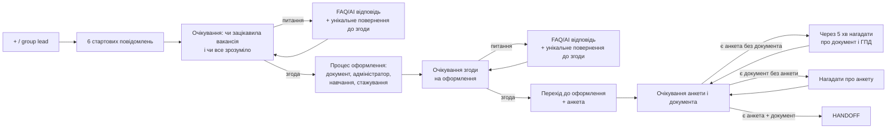

# Фактичне дерево V2-сценарію

Джерело істини для runtime — `auto_reply.py`. Цей документ описує новий main path після зміни сценарію Furioza Company.

## Main Path



## 1. Стартові повідомлення

Після старту бот надсилає 6 повідомлень підряд:

1. Привітання від Володимира і контекст заявки.
2. Furioza Company, міжнародна дейтінгова платформа, суть роботи, навчання і стажування.
3. Заробіток: 300 $ гарантовано у 1-й місяць + 48% базових + 20% бонусних, подарунки 20–27%, далі 40% з ростом до 45–47% за KPI.
4. Графік: денна 14:00–23:00 або нічна 23:00–08:00, 5–7 плаваючих вихідних, аванс і виплати.
5. Вимога ПК або ноутбука.
6. Питання, чи зацікавила вакансія і чи все зрозуміло.

Після 6-го повідомлення сценарій чекає відповідь кандидата на `STEP_COMPANY_INTRO`.

## 2. Питання після старту

Якщо кандидат ставить питання, бот відповідає через trained answers / FAQ / AI, а потім повертає до рішення унікальним follow-up prompt. Приклад базового повернення:

```text
Чудово. Скажіть, будь ласка, чи наразі все зрозуміло щодо вакансії? Чи зрозуміла сама специфіка роботи? Хочу, щоб перед початком співпраці все було максимально прозоро.
```

Після згоди сценарій переходить до пояснення процесу оформлення.

## 3. Процес оформлення

Бот надсилає повідомлення про те, що потрібно підтвердити особу, після чого дані передаються адміністратору. Навчання займає кілька годин, далі йде стажування, адміністратор залишається на зв’язку.

Після цього сценарій чекає окрему згоду. Якщо кандидат ставить питання — бот відповідає і повертає до згоди унікальним prompt.

## 4. Анкета

Після другої згоди бот надсилає:

```text
Супер. Тоді можемо переходити до оформлення
```

Потім просить:

1. Документ для підтвердження особи.
2. Telegram-нік.
3. Номер телефону.
4. Електронну пошту.
5. Місто проживання.
6. Обрану зміну: денна або нічна.

Етап завершується тільки після отримання і анкети, і фото/скріну документа. Якщо кандидат надсилає фото з підписом, який схожий на заповнену анкету, це зараховується як обидва елементи.

## 5. Документ

На питання про документ бот пріоритетно відповідає:

```text
Документ потрібен для оформлення за договором ГПД, створення доступів і підтвердження, що в системі використовуються саме Ваші дані. Договір фіксує умови співпраці та виплат, а дані не використовуються без Вашої згоди і залишаються конфіденційними.
```

Це оформлення за договором ГПД, не штатне трудове працевлаштування.

## Legacy-сумісність

Старі runtime-кроки вибору зміни, voice, proof materials і test task більше не є happy path. Якщо кандидат уже знаходиться в одному зі старих state, сценарій м’яко переводить його до нового блоку оформлення або анкети без відправки старих матеріалів.
