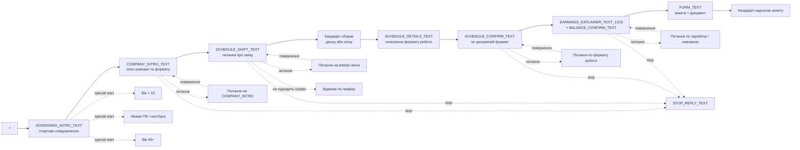

# Фактичне дерево діалогу від `+` до анкети

Цей файл описує реальну поточну логіку V2-сценарію за кодом `auto_reply.py`. Це не меню операторського бота з `bot.py`.

Джерело істини для порядку кроків:

- `auto_reply.py` — фактичний порядок повідомлень і переходів.
- `sales-script.md` — сенс етапів і формулювання для HR-воронки.
- `README.md` — загальна пояснювальна документація.

## Main Path

Нормальна основна лінія зараз виглядає так:



## Основна лінія

### 1. Старт від `+`

Кандидат пише:

```text
+
```

Після цього сценарій заводить кандидата у V2 і надсилає два стартові повідомлення підряд.

### 2. `SCREENING_INTRO_TEXT`

```text
Доброго дня.
Ви залишали відгук на вакансію чат-менеджера.
Коротко зорієнтую Вас по формату роботи, щоб Ви одразу розуміли, чи підходить Вам ця вакансія.
```

### 3. `COMPANY_INTRO_TEXT`

```text
Наша компанія Furioza Company працює у сфері дейтингу з 2014 року.

Формат роботи віддалений: тільки текстове спілкування, без дзвінків і відеозвʼязку, у full-time графіку 8 годин і лише з ПК або ноутбука.

На старті є навчання та супровід тімліда, тому Ви одразу розумієте, як рухатися далі.

Якщо такий формат Вам у цілому підходить, можемо перейти далі?
```

Якщо кандидат відповідає по суті `так`, сценарій переходить одразу до блоку вибору зміни.

### 4. `SCHEDULE_SHIFT_TEXT`

Це обовʼязковий крок main path. Саме тут бот вперше прямо питає про зміну.

```text
По графіку: у нас є 2 зміни на вибір, і Ви обираєте одну на постійній основі:
- Денна 14:00–23:00
- Нічна 23:00–08:00
На кожній зміні передбачено:
- 1 година основної перерви
- Короткі міні-перерви по 5 хвилин
Щодо вихідних: у Вас є 8 вихідних днів на місяць, їх можна планувати самостійно.
Підкажіть, будь ласка, яку зміну Вам зручніше розглянути: денну чи нічну?
```

Нормальна відповідь кандидата:

```text
Денна
```

або

```text
Нічна
```

### 5. Після вибору зміни: `SCHEDULE_DETAILS_TEXT`

```text
Коротко по формату роботи.
Ви працюєте одночасно на декількох анкетах у своїй зміні та взаємодієте з командою в Telegram, де можна швидко узгоджувати робочі моменти.

Що важливо розуміти:
Робота full-time та досить інтенсивна, тобто це не формат "просто бути онлайн".
У Вас буде особистий кабінет, де фіксується робочий час.
Навчання триває близько 8 днів і проходить під супроводом тімліда.
```

### 6. Підтвердження формату: `SCHEDULE_CONFIRM_TEXT`

```text
Чи зрозумілий Вам у цілому формат роботи? Якщо так, зможемо перейти далі.
```

Якщо кандидат підтверджує, сценарій веде в блок заробітку та навчання.

### 7. Блок заробітку та навчання

#### `EARNINGS_EXPLAINER_TEXT_1`

```text
Коротко про те, як тут формується заробіток.

Сайт для чоловіків платний: вони оплачують хвилини чату, листи, фото, відео та інші дії на платформі. Завдання чат-менеджера - вести сильну комунікацію, утримувати інтерес користувача і продовжувати діалог. Тобто дохід тут напряму повʼязаний не зі ставкою, а з тим, наскільки якісно вибудовується спілкування.
```

#### `EARNINGS_EXPLAINER_TEXT_2`

```text
Тепер про баланс і оплату.

Баланс анкети формується з витрат користувачів на платформі, а Ваш дохід рахується як відсоток від цього балансу. У перший місяць базовий відсоток становить 48%, окремо враховуються реальні подарунки. На старті дохід зазвичай нижчий, тому що ще формується база постійних фаворитів, але з досвідом і регулярною активністю він росте значно стабільніше.
```

#### `EARNINGS_EXPLAINER_TEXT_3`

```text
І окремо про навчання.

Навчання для кандидата безкоштовне: воно проходить онлайн, включає текстові матеріали, відео, тести та супровід тімліда. Після цього Ви переходите до стажування вже з розумінням процесу, а не всліпу. Якщо по формату, заробітку та навчанню все ок, далі логічний крок - одразу перейти до анкети.
```

#### `BALANCE_CONFIRM_TEXT`

```text
Якщо по заробітку та навчанню все зрозуміло, можемо переходити далі.
```

### 8. `FORM_TEXT`

Після підтвердження на попередньому кроці бот переходить до анкети.

```text
Фінальний етап перед стартом — заповнення анкети.
Будь ласка, надішліть мені наступну інформацію:

1. ПІБ
2. Дата народження
3. Контактний номер телефону
4. Посилання на Telegram
5. Чи є у вас діти до 3 років
6. Обрана зміна
7. Дата, з якої готові розпочати стажування
8. Місто проживання
9. Електронна пошта
10. Скріншот документа для підтвердження віку

Документ потрібен лише для підтвердження віку
та внутрішньої перевірки компанії.
Інформація не передається третім особам.
```

На цій версії дерева основна лінія закінчується входом у крок анкети.

## Паралельні питання

### 1. Питання на `COMPANY_INTRO`

Типовий зміст:

```text
Так, а про що спілкування?
```

Що робить сценарій:

- дає коротку відповідь через FAQ / trained answer / fallback;
- не втрачає етап;
- після відповіді повертає кандидата до рішення “чи підходить формат”.

Повернення:

```text
... Якщо такий формат Вам підходить, покажу наступний етап.
```

Після цього main path іде в `SCHEDULE_SHIFT_TEXT`.

Окремий варіант на цьому ж кроці:

- якщо кандидат питає саме про заробіток ще до вибору зміни, код може одразу запустити detour у повний блок `EARNINGS_EXPLAINER_TEXT_1/2/3`;
- після цього сценарій повертає кандидата у відповідний checkpoint, а не ламає основну лінію.

### 2. Питання на `SCHEDULE_SHIFT_WAIT`

Типові варіанти:

```text
А який там графік?
```

або

```text
А інший графік є?
```

Що робить сценарій:

- якщо це уточнення по зміні, відповідає і повертає до питання про денну / нічну;
- якщо це заперечення проти fixed-графіка, окремо перепитує:

```text
У нас доступні лише денна та нічна зміни на постійній основі. Чи підходить вам такий графік?
```

Повернення:

```text
Підкажіть, будь ласка, яку зміну Вам зручніше розглянути: денну чи нічну?
```

Якщо на цьому етапі питання саме про заробіток, сценарій також може піти в detour через повний блок про дохід і повернутися назад до вибору зміни.

### 3. Питання на `SCHEDULE_CONFIRM`

Типовий зміст:

```text
Не до кінця зрозуміло, як саме виглядає робота.
```

Що робить сценарій:

- відповідає через FAQ / fallback по формату;
- залишає кандидата на цьому ж кроці;
- після відповіді знову веде до підтвердження формату.

Повернення:

```text
Чи зрозумілий Вам у цілому формат роботи? Якщо так, зможемо перейти далі.
```

Якщо тут кандидат питає про дохід раніше основного блоку, сценарій може відкрити detour у `EARNINGS_EXPLAINER_TEXT_1/2/3`, а потім повернутися до поточного checkpoint.

### 4. Питання на `BALANCE_CONFIRM`

Типові питання:

```text
А як нараховується зарплата?
```

```text
А коли виплата?
```

```text
Які документи потрібні?
```

Що робить сценарій:

- якщо питання про дохід зʼявляється до повного блоку — запускає detour в блок `EARNINGS_EXPLAINER_TEXT_1/2/3`;
- якщо питання вже на етапі `BALANCE_CONFIRM`, відповідає і повертає до рішення про анкету.

Повернення:

```text
Якщо по заробітку та навчанню все зрозуміло, можемо переходити далі.
```

Після цього main path іде в `FORM_TEXT`.

## Stop / відмова

### 1. Stop на wait-етапах

На wait-етапах сценарій обробляє жорсткий stop і надсилає:

```text
Розумію, дякую за відповідь. Якщо обставини зміняться, дайте знати.
```

Це може статись на:

- `COMPANY_INTRO`
- `SCHEDULE_SHIFT_WAIT`
- `SCHEDULE_CONFIRM`
- `BALANCE_CONFIRM`

### 2. Відмова по графіку

Якщо кандидат прямо показує, що fixed-графік не підходить, сценарій веде в окрему гілку відмови по графіку.

Спочатку йде уточнення:

```text
У нас доступні лише денна та нічна зміни на постійній основі. Чи підходить вам такий графік?
```

Якщо відповідь `ні`, сценарій завершується через stop-відповідь.

## Special start

Ці гілки відсікають кандидата ще до normal happy path.

### 1. Вік < 15

```text
Дякую за інтерес до вакансії.

Хочу одразу повідомити, що ця вакансія не підходить для такого віку.
```

### 2. Немає ПК / ноутбука

```text
Дякую за інтерес до вакансії.

Хочу одразу попередити, що без ПК або ноутбука ця робота не підійде. Зміна триває 8 годин, робота ведеться в особистому кабінеті, і паралельно потрібно вести кілька текстових діалогів. З телефона підтримувати такий темп стабільно та якісно не вийде.
```

### 3. Вік 40+

```text
Дякую за інтерес до вакансії.

Хочу одразу попередити, що в цьому форматі робота може бути складною для кандидатів 40+. Тут потрібно дуже багато й швидко спілкуватися в текстовій переписці протягом 8 годин, і за внутрішньою статистикою кандидати цієї вікової категорії зазвичай не справляються з таким навантаженням.
```

## Що не входить у це дерево

- reminder / follow-up по таймерах;
- recovery-механіки та службові runtime-стани;
- те, що відбувається після фактичного заповнення анкети;
- меню операторського `bot.py`.
